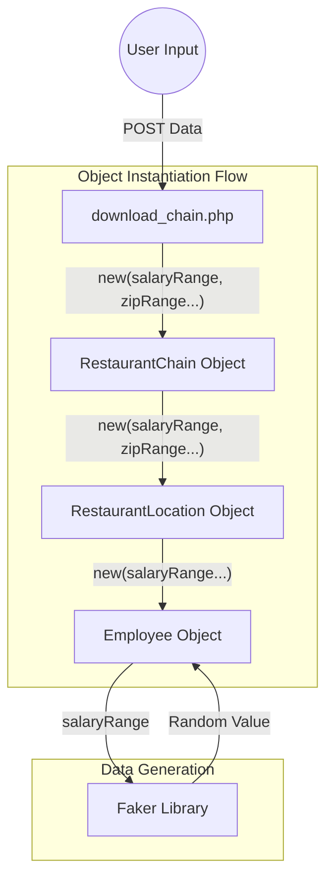

# Restaurant Chain Mockup Extension

## 概要
**Restaurant Chain Mockup Extension** は、オブジェクト指向 PHP を用いて開発された、カスタマイズ可能なレストランチェーンのモックデータ生成ツールです。

ユーザーはウェブブラウザ上のフォームを通じて、店舗数、従業員数、給与範囲、郵便番号の範囲などの具体的な条件を指定できます。システムはこれらのパラメータに基づき、Faker ライブラリを活用して「企業 → 店舗 → 従業員」という階層構造を持つリアリティのあるダミーデータを生成します。生成されたデータは、HTML, JSON, Markdown, Text 形式でダウンロード可能です。

## 特徴
- **階層的なデータ生成**: `RestaurantChain` (チェーン全体) ＞ `RestaurantLocation` (各店舗) ＞ `Employee` (従業員) という3層構造のデータを一括生成します。
- **詳細なカスタマイズ**: コードを書き換えることなく、以下のパラメータをフォームから動的に指定可能です。
  - チェーン全体の店舗数
  - 郵便番号の範囲 (地域設定のシミュレーション)
  - 1店舗あたりの従業員数
  - 従業員の給与範囲 (最小・最大)
- **多形式エクスポート**: 用途に応じて、以下のフォーマットでデータを出力できます。
  - **HTML**: ブラウザでの確認用（Bootstrap 5 によるスタイリング済み）
  - **JSON**: API レスポンスのモックやデータ解析用
  - **Markdown**: ドキュメント用
  - **Text**: プレーンテキストログ用
- **オブジェクト指向設計**: インターフェースや継承、コンポジションを適切に使用し、拡張性の高い設計を採用しています。

## このプロジェクトを通して学べること・習得できること

このプロジェクトは、単なるデータ生成スクリプトではなく、**PHP におけるモダンなオブジェクト指向設計（OOP）** の実践的な学習教材として設計されています。

### 1. データのバケツリレー（Parameter Propagation）とコンストラクタ設計
ユーザー入力（Controller）から最下層のデータモデル（Employee）まで、コンストラクタを経由して設定値を伝播させる設計パターンを学べます。これにより、トップレベルの制御のみで詳細なデータ仕様を変更する柔軟なアーキテクチャを理解できます。

## 使用方法
1. ブラウザで以下の URL にアクセスします。
   `http://localhost:8000/src/generate_chain.php`

2. 表示されたフォームに以下の条件を入力します。
   - **店舗設定**: 店舗数、郵便番号の範囲
   - **従業員設定**: 1店舗あたりの従業員数、給与範囲
   - **出力設定**: ファイル形式（HTML, JSON, Markdown, Text）

3. 「生成してダウンロード」ボタンをクリックします。
   - **HTML** を選択した場合はブラウザに結果が表示されます。
   - その他の形式を選択した場合は、生成されたファイルがダウンロードされます。

## 機能一覧
- **レストランチェーン生成**: 指定されたパラメータでチェーン全体のデータを生成。
- **従業員データ生成**: 職種、給与（指定範囲内）、開始日、受賞歴などをランダム生成。
- **店舗データ生成**: 住所、郵便番号（指定範囲内）、開店状況などをランダム生成。
- **フォーマット変換**: オブジェクトデータを各種フォーマット文字列へ変換。

## 技術スタック
- **言語**: PHP 8.x
- **ライブラリ**: FakerPHP/Faker (ダミーデータ生成)
- **依存管理**: Composer
- **フロントエンド**: Bootstrap 5 (CSS Framework)

## 追加資料
プロジェクトの構造や設計に関する詳細な資料は以下のディレクトリに含まれています。

- `diagrams`: UML図（クラス図、シーケンス図など）
  - `class.pu`: クラス構造図
  - `sequence.pu`: 処理フロー図
  - `architecture.md`: アーキテクチャ詳細解説
- `memorandums`: 技術的なメモ書き
  - `php_obj_mock.md`: このモックアップツールの実装解説

## 貢献方法
1. このリポジトリを Fork してください。
2. 新しい Branch を作成してください (`git checkout -b feature/amazing-feature`)。
3. 変更を Commit してください (`git commit -m 'Add some amazing feature'`)。
4. Branch に Push してください (`git push origin feature/amazing-feature`)。
5. Pull Request を作成してください。

## ライセンス
このプロジェクトは MIT License の下で公開されています。