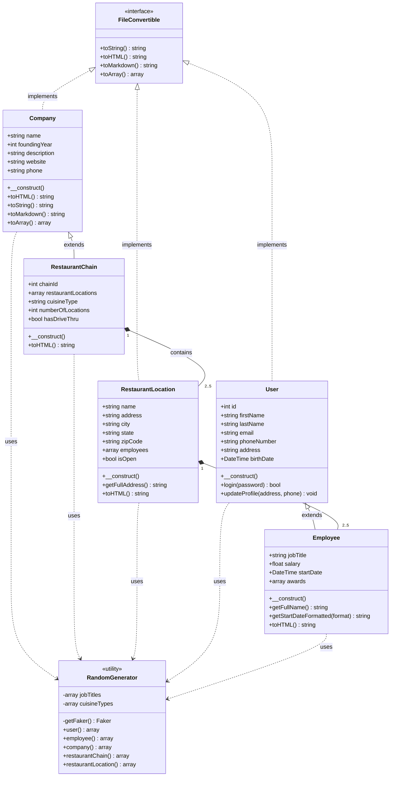
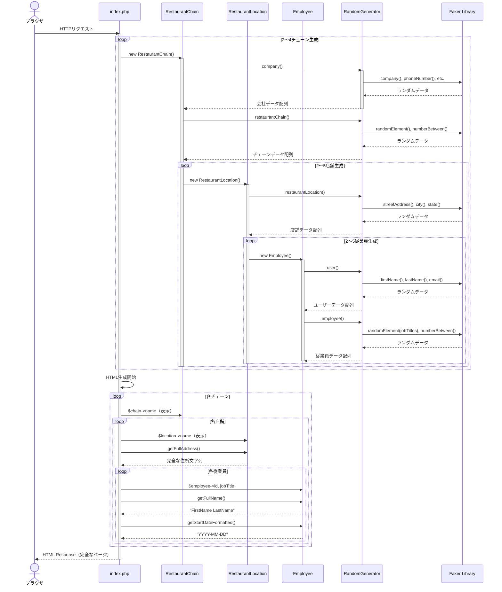
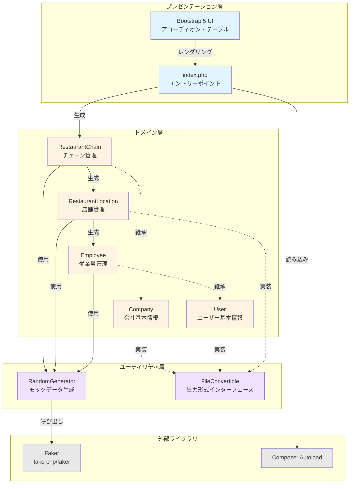
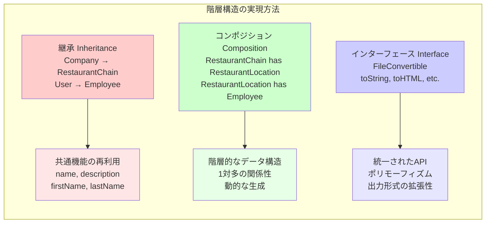

# PHPオブジェクト指向で実装するレストランチェーン管理システムのアーキテクチャ設計

## リード文

本記事では、PHPのオブジェクト指向プログラミング（OOP）を活用して、**レストランチェーン管理システム**を設計・実装する方法を解説します。単一のレストラン管理ではなく、**複数のチェーン → 店舗 → 従業員**という3層の階層構造を持つ実用的なシステムを、クラス設計・継承・インターフェースを駆使して構築します。

この記事を読むことで、以下のスキルが身につきます：

- **階層構造を持つドメインモデルの設計方法**
- **PHPにおけるクラス継承とインターフェースの実装パターン**
- **ランダムデータ生成（Faker）を用いたモック開発の実践**
- **Bootstrap 5を使った動的UIの実装**

実務でよくある「企業 → 支店 → 社員」や「学校 → クラス → 生徒」といった階層的なデータモデルの設計にも応用できる内容です。

---

## 前提知識

本記事を理解するために、以下の知識があると望ましいです：

- **PHP 7.4以上の基本文法**（クラス、継承、型宣言、名前空間）
- **オブジェクト指向プログラミングの基礎**（クラス、オブジェクト、継承、インターフェース）
- **Composer**の基本的な使い方（`composer.json`、`autoload`）
- **HTML/CSS/JavaScript**の基礎（Bootstrap 5の基本的な使い方）

必須ではありませんが、以下の知識があるとより理解が深まります：

- デザインパターン（Factory、Strategy）
- MVCアーキテクチャの概念
- データベース設計の基礎

---

## Context（背景・問題意識）

### なぜこのアーキテクチャが必要なのか？

実務のWebアプリケーション開発では、単純なCRUD（作成・読取・更新・削除）だけでなく、**複雑な階層構造を持つデータモデル**を扱うケースが頻繁にあります。

例えば：

- **企業管理システム**: 本社 → 支店 → 部署 → 社員
- **教育プラットフォーム**: 学校 → 学年 → クラス → 生徒
- **ECサイト**: カテゴリ → サブカテゴリ → 商品 → バリエーション

このような階層構造を、適切なクラス設計なしに実装すると、以下の問題が発生します：

1. **コードの重複**: 各階層で同じようなデータ処理を繰り返し書く
2. **保守性の低下**: 仕様変更時に複数箇所を修正する必要がある
3. **拡張性の欠如**: 新しい階層や属性を追加するのが困難
4. **テストの困難さ**: 依存関係が複雑で単体テストが書きにくい

本記事で紹介する**レストランチェーン管理システム**は、これらの問題を解決するアーキテクチャパターンを実装した実例です。

### システムの要件

このシステムは以下の要件を満たします：

- **3層の階層構造**: `RestaurantChain` → `RestaurantLocation` → `Employee`
- **動的なデータ生成**: Fakerライブラリによるモックデータの自動生成
- **柔軟な出力形式**: HTML、Markdown、JSON、プレーンテキストに対応
- **保守性の高い設計**: インターフェースと継承を活用した拡張可能な構造
- **視認性の高いUI**: Bootstrap 5によるアコーディオン形式の表示

---

## Core Concept（中核となる考え方）

### 1. クラス設計の全体像

本システムは以下のクラス構成で実装されています：

```
FileConvertible (Interface)
    ├── Company
    │   └── RestaurantChain
    ├── RestaurantLocation
    └── User
        └── Employee
```

#### クラスの役割

| クラス名 | 役割 | 親クラス/インターフェース |
|---------|------|------------------------|
| `FileConvertible` | 出力形式の統一インターフェース | - |
| `Company` | 会社の基本情報を管理 | `FileConvertible` |
| `RestaurantChain` | レストランチェーンを表現（複数店舗を保持） | `Company` |
| `RestaurantLocation` | 個別店舗の情報を管理（複数従業員を保持） | `FileConvertible` |
| `User` | ユーザーの基本情報を管理 | `FileConvertible` |
| `Employee` | 従業員固有の情報を管理 | `User` |

### 2. インターフェース `FileConvertible` の設計

すべてのドメインクラスが実装するインターフェースです。これにより、**どのクラスも複数の形式で出力できる**ことが保証されます。

```php
<?php
interface FileConvertible {
    public function toString(): string;
    public function toHTML(): string;
    public function toMarkdown(): string;
    public function toArray(): array;
}
```

#### 設計の意図

- **統一されたAPI**: すべてのクラスが同じメソッド名で出力できる
- **出力形式の拡張性**: 新しい形式（例：XML、CSV）を追加しやすい
- **ポリモーフィズムの活用**: インターフェース型で扱うことで、実装クラスを意識せずに処理できる

### 3. 継承による共通機能の集約

#### `Company` クラス（基底クラス）

レストランチェーンの基本情報を管理する基底クラスです。

```php
<?php
class Company implements FileConvertible {
    public string $name;
    public int $foundingYear;
    public string $description;
    public string $website;
    public string $phone;
    // ...その他のプロパティ

    public function __construct() {
        $data = RandomGenerator::company();
        $this->name = $data['name'];
        $this->foundingYear = $data['foundingYear'];
        // ...プロパティの初期化
    }

    public function toHTML(): string {
        return "<h1>{$this->name}</h1><p>{$this->description}</p>";
    }

    public function toString(): string { return $this->name; }
    public function toMarkdown(): string { return "# {$this->name}"; }
    public function toArray(): array { return get_object_vars($this); }
}
```

#### `RestaurantChain` クラス（派生クラス）

`Company`を継承し、チェーン固有の機能を追加します。

```php
<?php
class RestaurantChain extends Company {
    public int $chainId;
    public array $restaurantLocations; // RestaurantLocationの配列
    public string $cuisineType;
    public int $numberOfLocations;
    public bool $hasDriveThru;
    public int $yearFounded;
    public string $parentCompany;

    public function __construct() {
        parent::__construct(); // 親クラスのコンストラクタを呼び出し
        
        $data = RandomGenerator::restaurantChain();
        $this->chainId = $data['chainId'];
        $this->cuisineType = $data['cuisineType'];
        // ...その他の初期化

        // 2〜5店舗をランダム生成
        $locationCount = rand(2, 5);
        $this->restaurantLocations = [];
        for ($i = 0; $i < $locationCount; $i++) {
            $this->restaurantLocations[] = new RestaurantLocation();
        }
    }

    public function toHTML(): string {
        $html = parent::toHTML(); // 親クラスのHTMLを継承
        foreach ($this->restaurantLocations as $loc) {
            $html .= $loc->toHTML();
        }
        return $html;
    }
}
```

**ポイント**: `parent::__construct()`で親クラスの初期化処理を呼び出し、`Company`の基本情報を設定してから、チェーン固有のプロパティを追加します。

### 4. コンポジション（集約）による階層構造の実現

`RestaurantChain`は複数の`RestaurantLocation`を保持し、各`RestaurantLocation`は複数の`Employee`を保持します。これを**コンポジション（Has-A関係）**と呼びます。

```php
// RestaurantLocation.php
class RestaurantLocation implements FileConvertible {
    public string $name;
    public string $address;
    public string $city;
    public string $state;
    public string $zipCode;
    public array $employees; // Employeeの配列
    public bool $isOpen;

    public function __construct() {
        $data = RandomGenerator::restaurantLocation();
        $this->name = $data['name'];
        $this->address = $data['address'];
        // ...その他の初期化

        // 2〜5名の従業員をランダム生成
        $employeeCount = rand(2, 5);
        $this->employees = [];
        for ($i = 0; $i < $employeeCount; $i++) {
            $this->employees[] = new Employee();
        }
    }

    public function getFullAddress(): string {
        return "{$this->address}, {$this->city}, {$this->state} {$this->zipCode}";
    }

    public function toHTML(): string {
        $html = "<h3>{$this->name}</h3><p>{$this->getFullAddress()}</p><ul>";
        foreach ($this->employees as $e) {
            $html .= $e->toHTML();
        }
        return $html . "</ul>";
    }
}
```

### 5. ヘルパーメソッドによる可読性向上

`Employee`クラスでは、表示用のヘルパーメソッドを提供しています。

```php
// Employee.php
class Employee extends User {
    public string $jobTitle;
    public float $salary;
    public DateTime $startDate;
    public array $awards;

    public function __construct() {
        parent::__construct(); // Userの基本情報を初期化
        
        $data = RandomGenerator::employee();
        $this->jobTitle = $data['jobTitle'];
        $this->salary = $data['salary'];
        $this->startDate = $data['startDate'];
        $this->awards = $data['awards'];
    }

    public function getFullName(): string {
        return "{$this->firstName} {$this->lastName}";
    }

    public function getStartDateFormatted(string $format = 'Y-m-d'): string {
        return $this->startDate->format($format);
    }

    public function toHTML(): string {
        $name = $this->getFullName();
        return "<li>{$this->jobTitle} - {$name}</li>";
    }
}
```

**メリット**:
- ビュー側で`$employee->firstName . ' ' . $employee->lastName`と書く必要がない
- 日付フォーマットのロジックをビューから分離できる
- 名前の表示形式を変更する際、メソッド1箇所を修正すればよい

### 6. モックデータ生成の実装

Fakerライブラリを使って、リアルなランダムデータを生成します。

```php
// RandomGenerator.php
use Faker\Factory;

class RandomGenerator {
    private static array $jobTitles = ['Chef', 'Waiter', 'Manager', 'Bartender', 'Host'];
    private static array $cuisineTypes = ['Italian', 'Japanese', 'Chinese', 'Mexican', 'French'];

    private static function getFaker() {
        return Factory::create('en_US');
    }

    public static function employee(): array {
        $faker = self::getFaker();
        return [
            'jobTitle' => $faker->randomElement(self::$jobTitles),
            'salary' => $faker->numberBetween(30000, 80000),
            'startDate' => new DateTime($faker->dateTimeBetween('-10 years', 'now')->format('Y-m-d')),
            'awards' => $faker->boolean(30) ? [$faker->randomElement(self::$awards)] : []
        ];
    }
    
    // company(), restaurantChain(), restaurantLocation()なども同様に実装
}
```

**設計のポイント**:
- 各クラスのコンストラクタから`RandomGenerator`を呼び出す
- Fakerのインスタンス生成を`getFaker()`に集約し、ロケール設定を統一
- 固定の選択肢（職種、料理タイプ）は配列で管理

### 7. フロントエンド実装（Bootstrap 5アコーディオン）

複数のチェーン・店舗・従業員を動的に表示するビューを実装します。

```php
<?php
// index.php
require_once __DIR__ . '/../vendor/autoload.php';
require_once __DIR__ . '/classes/RestaurantChain.php';

// 2〜4個のチェーンをランダム生成
$chains = [];
$chainCount = rand(2, 4);
for ($i = 0; $i < $chainCount; $i++) {
    $chains[] = new RestaurantChain();
}

// XSS対策用のエスケープ関数
function e($value): string {
    return htmlspecialchars((string)$value, ENT_QUOTES, 'UTF-8');
}
?>
<!doctype html>
<html lang="ja">
<head>
    <meta charset="utf-8">
    <meta name="viewport" content="width=device-width, initial-scale=1">
    <title>Restaurant Chains Management</title>
    <link href="https://cdn.jsdelivr.net/npm/bootstrap@5.3.3/dist/css/bootstrap.min.css" rel="stylesheet">
</head>
<body class="bg-light">
    <div class="container py-4">
        <header class="mb-4">
            <h1 class="display-4 fw-bold mb-2">Restaurant Chains</h1>
            <p class="text-muted mb-0">レストランチェーン管理ページ</p>
        </header>

        <?php foreach ($chains as $chainIndex => $chain): ?>
            <section class="mb-5">
                <h2 class="h3 fw-bold"><?= e($chain->name) ?></h2>
                
                <div class="accordion" id="locationsAccordion<?= $chainIndex ?>">
                    <?php foreach ($chain->restaurantLocations as $locIndex => $location): ?>
                        <div class="accordion-item">
                            <h2 class="accordion-header" id="heading<?= $chainIndex ?>_<?= $locIndex ?>">
                                <button class="accordion-button collapsed" type="button" 
                                        data-bs-toggle="collapse" 
                                        data-bs-target="#collapse<?= $chainIndex ?>_<?= $locIndex ?>">
                                    <?= e($location->name) ?>
                                </button>
                            </h2>
                            <div id="collapse<?= $chainIndex ?>_<?= $locIndex ?>" 
                                 class="accordion-collapse collapse">
                                <div class="accordion-body">
                                    <h3 class="h5"><?= e($location->name) ?></h3>
                                    <p class="text-muted"><?= e($location->getFullAddress()) ?></p>
                                    
                                    <table class="table table-striped">
                                        <thead>
                                            <tr>
                                                <th>ID</th>
                                                <th>Job Title</th>
                                                <th>Name</th>
                                                <th>Start Date</th>
                                            </tr>
                                        </thead>
                                        <tbody>
                                            <?php foreach ($location->employees as $employee): ?>
                                                <tr>
                                                    <td><?= e($employee->id) ?></td>
                                                    <td><?= e($employee->jobTitle) ?></td>
                                                    <td><?= e($employee->getFullName()) ?></td>
                                                    <td><?= e($employee->getStartDateFormatted()) ?></td>
                                                </tr>
                                            <?php endforeach; ?>
                                        </tbody>
                                    </table>
                                </div>
                            </div>
                        </div>
                    <?php endforeach; ?>
                </div>
            </section>
        <?php endforeach; ?>
    </div>

    <script src="https://cdn.jsdelivr.net/npm/bootstrap@5.3.3/dist/js/bootstrap.bundle.min.js"></script>
</body>
</html>
```

**実装のポイント**:
- **ネストしたループ**: チェーン → 店舗 → 従業員の3層を`foreach`で処理
- **一意なID生成**: `$chainIndex`と`$locIndex`を組み合わせてBootstrapのアコーディオンIDを生成
- **XSS対策**: `htmlspecialchars()`を使った出力エスケープ関数`e()`を用意
- **レスポンシブ対応**: Bootstrapのグリッドシステムとテーブルクラスを使用

---

## 落とし穴・注意点

### 1. オートロードの設定ミス

PHPのクラスファイルを読み込む際、以下のような問題が発生しやすいです：

**❌ よくあるミス**:
```php
// require_onceを書き忘れる、または相対パスが間違っている
require_once 'classes/Employee.php'; // ← 実行ディレクトリによってはエラー
```

**✅ 推奨する方法**:
```php
// __DIR__を使って絶対パスを構築
require_once __DIR__ . '/../vendor/autoload.php';

// または、spl_autoload_registerでオートロードを設定
spl_autoload_register(function($class) {
    $file = __DIR__ . '/' . str_replace('\\', '/', $class) . '.php';
    if (file_exists($file)) include $file;
});
```

### 2. コンストラクタでの依存関係の注入を忘れる

`Employee`クラスが`User`を継承している場合、**必ず親クラスのコンストラクタを呼ぶ**必要があります。

**❌ 誤った実装**:
```php
class Employee extends User {
    public function __construct() {
        // parent::__construct(); を呼び忘れ
        $data = RandomGenerator::employee();
        $this->jobTitle = $data['jobTitle'];
    }
}
// → $this->firstName などが初期化されない
```

**✅ 正しい実装**:
```php
class Employee extends User {
    public function __construct() {
        parent::__construct(); // 親クラスで firstName, lastName などを初期化
        $data = RandomGenerator::employee();
        $this->jobTitle = $data['jobTitle'];
    }
}
```

### 3. BootstrapアコーディオンのIDの重複

複数のアコーディオンを動的に生成する際、**IDが重複するとアコーディオンが正しく動作しません**。

**❌ 誤った実装**:
```php
<?php foreach ($locations as $location): ?>
    <div id="collapse1"> <!-- すべて同じIDになってしまう -->
```

**✅ 正しい実装**:
```php
<?php foreach ($locations as $index => $location): ?>
    <div id="collapse<?= $chainIndex ?>_<?= $index ?>"> <!-- チェーンと店舗のインデックスを組み合わせる -->
```

### 4. DateTimeオブジェクトの出力ミス

`DateTime`オブジェクトをそのまま出力しようとするとエラーになります。

**❌ 誤った実装**:
```php
echo $employee->startDate; // ← エラー: Object of class DateTime could not be converted to string
```

**✅ 正しい実装**:
```php
echo $employee->startDate->format('Y-m-d'); // 'Y-m-d'形式で文字列に変換
// または、ヘルパーメソッドを使う
echo $employee->getStartDateFormatted();
```

### 5. セキュリティ: XSS攻撃への対策

ユーザー入力や外部データをHTMLに出力する際は、**必ずエスケープ処理**を行います。

**❌ 危険な実装**:
```php
<h1><?= $chain->name ?></h1> <!-- エスケープなし -->
```

**✅ 安全な実装**:
```php
<?php
function e($value): string {
    return htmlspecialchars((string)$value, ENT_QUOTES, 'UTF-8');
}
?>
<h1><?= e($chain->name) ?></h1>
```

---

## まとめ

本記事では、PHPのオブジェクト指向プログラミングを活用した**レストランチェーン管理システム**の設計と実装を解説しました。

### 学んだこと

1. **階層構造を持つドメインモデルの設計**
   - 継承（`Company` → `RestaurantChain`、`User` → `Employee`）
   - コンポジション（`RestaurantChain` has-many `RestaurantLocation` has-many `Employee`）

2. **インターフェースによる統一API**
   - `FileConvertible`インターフェースで複数の出力形式に対応

3. **Fakerを使ったモックデータ生成**
   - 開発段階でリアルなテストデータを自動生成

4. **Bootstrap 5によるレスポンシブUI**
   - アコーディオン形式で階層データを視覚的に表示

5. **セキュリティとベストプラクティス**
   - XSS対策、オートロード設定、DateTimeの扱い方

### 応用できる場面

このアーキテクチャパターンは、以下のような場面で活用できます：

- **企業管理システム**: 本社 → 支店 → 部署 → 社員
- **学習管理システム**: 学校 → 学年 → クラス → 生徒
- **ECサイト**: カテゴリ → サブカテゴリ → 商品 → バリエーション
- **プロジェクト管理**: 組織 → プロジェクト → タスク → 担当者

---

## Try It（読者が実際に試すための行動）

### ステップ1: プロジェクトのセットアップ

```bash
# プロジェクトディレクトリを作成
mkdir restaurant-system && cd restaurant-system

# composer.jsonを作成
cat > composer.json << 'EOF'
{
    "require": {
        "fakerphp/faker": "^1.23"
    },
    "autoload": {
        "psr-4": {
            "App\\": "src/classes/"
        }
    }
}
EOF

# 依存パッケージをインストール
composer install
```

### ステップ2: クラスファイルの作成

以下のディレクトリ構造でファイルを作成してください：

```
restaurant-system/
├── composer.json
├── vendor/
├── Helpers/
│   └── RandomGenerator.php
└── src/
    ├── index.php
    └── classes/
        ├── FileConvertible.php
        ├── Company.php
        ├── RestaurantChain.php
        ├── RestaurantLocation.php
        ├── User.php
        └── Employee.php
```

各ファイルの内容は、本記事の「Core Concept」セクションのコードを参考にしてください。

### ステップ3: 実行とテスト

```bash
# PHPビルトインサーバーを起動
cd src
php -S localhost:8000

# ブラウザで http://localhost:8000 を開く
```

### ステップ4: 拡張してみよう

以下の機能を追加して、理解を深めましょう：

1. **フィルタリング機能**: 従業員を職種で絞り込む
2. **ソート機能**: 従業員を給与順・入社日順に並び替える
3. **検索機能**: 店舗名や従業員名で検索する
4. **CSVエクスポート**: `FileConvertible`に`toCSV()`メソッドを追加
5. **データベース連携**: ランダム生成ではなくMySQLからデータを取得

### ステップ5: コードをGitHubに公開

```bash
git init
git add .
git commit -m "Initial commit: Restaurant Chain Management System"
git remote add origin <your-repository-url>
git push -u origin main
```

---

## システムアーキテクチャ図（Mermaid）

以下は、本システムの構造を視覚化したクラス図とシーケンス図です。

### クラス図：継承とコンポジションの関係



### シーケンス図：データ生成とレンダリングの流れ



### コンポーネント図：システム全体の構成



### アーキテクチャパターン図：責務の分離



---

これで、PHPオブジェクト指向を活用したレストランチェーン管理システムの設計と実装についての解説は完了です。

**ぜひ、実際にコードを書いて、動かして、拡張してみてください！**

何か質問や改善提案があれば、コメント欄でお知らせください。
