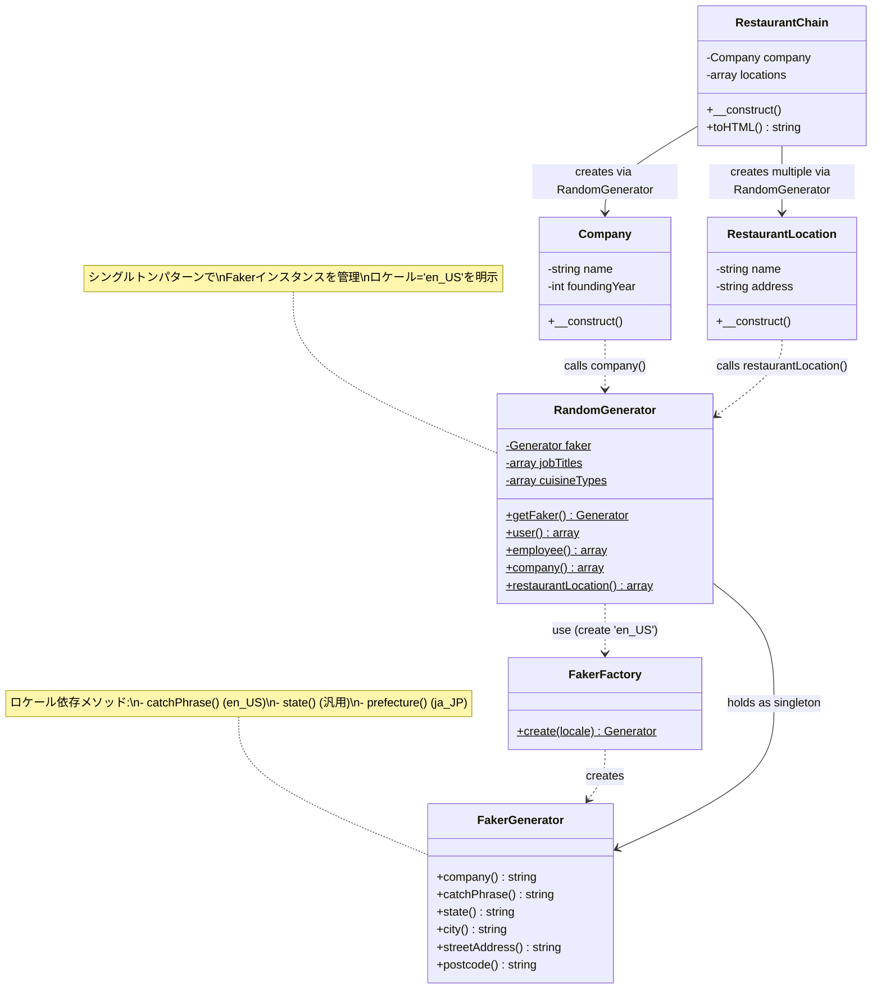

# PHPの組み込みサーバーとFakerで遭遇する"Unknown format"エラーの原因と解決法

## はじめに

PHPの組み込みサーバー（`php -S`）とFaker PHPを使ってダミーデータを生成するアプリケーションを開発していると、突然 `Fatal error: Uncaught InvalidArgumentException: Unknown format "catchPhrase"` のようなエラーに遭遇することがあります。

この記事では、**Fakerのロケール設定が原因で発生するエラーの解決方法**を、実際のトラブルシューティング過程を通じて解説します。同様の問題に直面している方、これからFakerを使い始める方にとって役立つ内容です。


- PHP 7.4以上の基本的な知識
- Composerの基本的な使い方
- Faker PHPライブラリの基本概念

## 問題の発生：組み込みサーバー起動時のエラー

### Context（背景・問題意識）

レストランチェーン管理システムを開発中、以下のようなエラーに遭遇しました：

```
Fatal error: Uncaught InvalidArgumentException: Unknown format "catchPhrase"
```

さらに修正後、今度は別のエラーが：

```
Fatal error: Uncaught InvalidArgumentException: Unknown format "prefecture"
```

これらのエラーは**Fakerのロケール設定**に起因するもので、特定のメソッドが特定のロケールでのみ利用可能であることが原因でした。

### Core Concept（中核となる考え方）

Faker PHPは**ロケール依存のプロバイダー**を持っています：

- `catchPhrase()`, `bs()`, `company()` → 主に `en_US` ロケールで利用可能
- `prefecture()` → `ja_JP` ロケール専用
- `state()` → 複数のロケールで利用可能（汎用的）

**重要な原則：** Fakerインスタンスを作成する際は、使用するメソッドがそのロケールでサポートされているか確認する必要があります。

## 実装例：正しいFaker初期化

### 問題のあったコード

```php
// ロケールを指定せずにFakerを初期化
private static function getFaker() {
    return Factory::create(); // デフォルトロケールが使われる
}

public static function company(): array {
    $faker = self::getFaker();
    return [
        'description' => $faker->catchPhrase(), // en_US以外でエラー
        // ...
    ];
}

public static function restaurantLocation(): array {
    $faker = self::getFaker();
    return [
        'state' => $faker->prefecture(), // ja_JP以外でエラー
        // ...
    ];
}
```

### 修正後のコード

```php
<?php

require_once __DIR__ . '/../vendor/autoload.php';

use Faker\Factory;
use Faker\Generator;

class RandomGenerator {
    private static ?Generator $faker = null;
    private static array $jobTitles = ['Chef', 'Waiter', 'Manager', 'Bartender', 'Host'];
    private static array $cuisineTypes = ['Italian', 'Japanese', 'Chinese', 'Mexican', 'French'];
    
    /**
     * Fakerインスタンスを取得（シングルトンパターン）
     * en_USロケールを明示的に指定
     */
    private static function getFaker(): Generator {
        if (self::$faker === null) {
            self::$faker = Factory::create('en_US'); // ロケールを明示
        }
        return self::$faker;
    }
    
    public static function company(): array {
        $faker = self::getFaker();
        return [
            'name' => $faker->company(),
            'description' => $faker->catchPhrase() . '. ' . $faker->bs(), // 安全に使用可能
            'website' => $faker->url(),
            'phone' => $faker->phoneNumber(),
            'ceo' => $faker->name(),
            'country' => 'Japan',
            'totalEmployees' => $faker->numberBetween(50, 10000)
        ];
    }
    
    public static function restaurantLocation(): array {
        $faker = self::getFaker();
        $city = $faker->city();
        return [
            'name' => $city . ' ' . $faker->randomElement(['Branch', 'Store', 'Location']),
            'address' => $faker->streetAddress(),
            'city' => $city,
            'state' => $faker->state(), // prefecture()からstate()に変更
            'zipCode' => $faker->postcode(),
            'isOpen' => $faker->boolean(90)
        ];
    }
}
```

## 落とし穴・注意点

### 1. ロケール指定を忘れる

```php
// ❌NG: デフォルトロケールに依存
$faker = Factory::create();

// ✅OK: 明示的にロケールを指定
$faker = Factory::create('en_US');
```

### 2. ロケール固有メソッドの混在

```php
// ❌NG: 異なるロケールのメソッドを混在
$faker = Factory::create('en_US');
$state = $faker->prefecture(); // ja_JP専用メソッド

// ✅OK: ロケールに合ったメソッドを使用
$faker = Factory::create('en_US');
$state = $faker->state(); // 汎用メソッド
```

### 3. シングルトンパターンの未実装

毎回新しいFakerインスタンスを作成すると、パフォーマンスが低下し、`unique()`メソッドの一意性も保証されません。

```php
// ❌NG: 毎回インスタンスを作成
public static function getUser() {
    $faker = Factory::create('en_US');
    return $faker->email();
}

// ✅OK: シングルトンで再利用
private static ?Generator $faker = null;

private static function getFaker(): Generator {
    if (self::$faker === null) {
        self::$faker = Factory::create('en_US');
    }
    return self::$faker;
}
```

## 応用例：多言語対応

実務では複数ロケールをサポートする場合もあります：

```php
class LocalizedRandomGenerator {
    private static array $fakers = [];
    
    private static function getFaker(string $locale = 'en_US'): Generator {
        if (!isset(self::$fakers[$locale])) {
            self::$fakers[$locale] = Factory::create($locale);
        }
        return self::$fakers[$locale];
    }
    
    public static function address(string $locale = 'en_US'): array {
        $faker = self::getFaker($locale);
        
        return [
            'street' => $faker->streetAddress(),
            'city' => $faker->city(),
            'state' => $locale === 'ja_JP' 
                ? $faker->prefecture() 
                : $faker->state(),
            'zipCode' => $faker->postcode()
        ];
    }
}

// 使用例
$usAddress = LocalizedRandomGenerator::address('en_US');
$jpAddress = LocalizedRandomGenerator::address('ja_JP');
```

## まとめ

- **Fakerは必ずロケールを明示的に指定**する（`Factory::create('en_US')`）
- **ロケール固有メソッドを使う前に互換性を確認**する
- **シングルトンパターンでFakerインスタンスを再利用**してパフォーマンスを向上
- 多言語対応の場合は、ロケールごとにインスタンスを管理する

これらの原則を守ることで、Fakerを使ったダミーデータ生成が安定し、予期しないエラーを防げます。

## Try It

1. 既存プロジェクトの`RandomGenerator`クラスで`Factory::create('en_US')`を明示的に指定
2. 使用しているFakerメソッドが指定したロケールで利用可能か[公式ドキュメント](https://fakerphp.github.io/)で確認
3. 本記事のシングルトンパターンを実装してパフォーマンスを測定

---

## アーキテクチャ図



この図は、`RandomGenerator`がFakerをシングルトンとして管理し、各エンティティクラスがそれを利用してダミーデータを生成する関係性を示しています。ロケール設定が全体の動作を制御する重要な要素であることが視覚的に理解できます。
