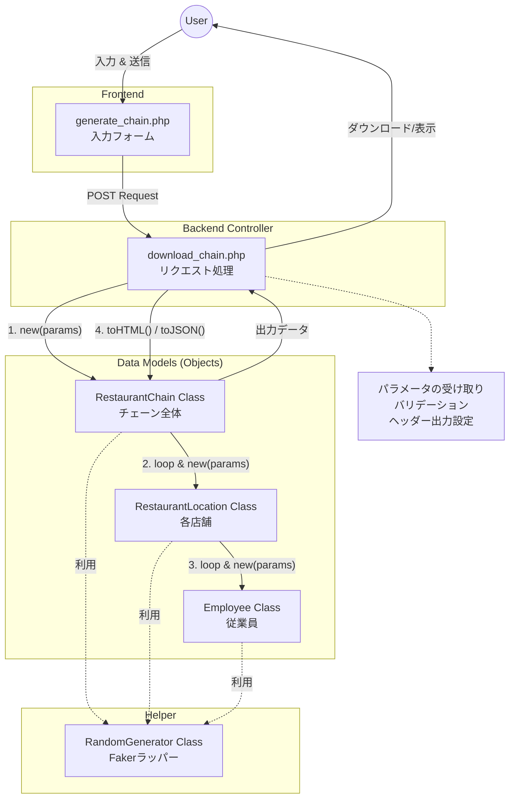

# 【PHP】オブジェクト指向で学ぶ！カスタマイズ可能な「レストランチェーン」モックデータ生成ツールの作り方

## はじめに

開発の現場では、「大量のテストデータ（モックデータ）」が必要になる場面が多々あります。顧客デモ用、負荷テスト用、UI確認用など、用途は様々です。

しかし、毎回手動でSQLを書いたり、ハードコードされたスクリプトを修正してデータを生成するのは非効率です。

この記事では、**「ユーザーがブラウザから条件を指定し、それに基づいた構造化データを生成・ダウンロードできるツール」**の作成を通して、PHPにおけるオブジェクト指向設計とフォーム処理の実践テクニックを解説します。

### この記事で得られること
*   フォーム入力値をクラスの深い階層まで伝播させる設計パターン
*   HTML, JSON, Markdownなど複数フォーマットでの出力制御
*   `Faker` ライブラリと自作クラスを組み合わせたデータ生成フロー

## 前提知識

*   PHP 8.x の基本構文
*   HTMLフォーム（GET/POST）の基礎
*   簡単なオブジェクト指向（クラス、コンストラクタ）の理解
*   Composer（Fakerライブラリの使用に使用）

---

## Context（背景・課題）

もともと、このプロジェクトには「ランダムなレストランチェーンのデータを生成するスクリプト」がありました。しかし、以下のような課題がありました。

*   **条件が固定:** 「店舗数は常に5店舗」「給与は固定範囲」など、コード内で値がハードコードされていた。
*   **変更が手間:**「もっと大規模なチェーンのデータが欲しい」と思ったら、コードを直接書き換える必要があった。

これを解決するために、**「設定画面（GUI）」を作成し、ユーザーが自由に条件を指定できるように拡張**します。

---

## Core Concept（中核となる考え方）

今回の実装の肝は、**「バケツリレー（Parameter Propagation）」**です。

ユーザーが入力したデータ（例：給与範囲 3万〜8万）は、以下のようにクラス階層を降りていく必要があります。

1.  **Controller (`download_chain.php`)**: フォームから値を受け取る。
2.  **Parent Class (`RestaurantChain`)**: チェーン全体の初期化時に値を受け取る。
3.  **Child Class (`RestaurantLocation`)**: 親から値を受け取り、店舗を生成する。
4.  **Grandchild Class (`Employee`)**: 店舗から値を受け取り、その範囲で従業員を生成する。

このように、コンストラクタを通じて親から子へ設定値を渡していく設計にすることで、トップレベルの制御だけで末端のデータ生成ルールを変更できるようになります。

---

## 実装ステップ

### 1. 入力フォームの作成 (`generate_chain.php`)

まず、ユーザーが条件を指定するためのUIを作成します。

```html
<!-- src/generate_chain.php -->
<form action="download_chain.php" method="post">
    <!-- 店舗数の指定 -->
    <label>店舗数: <input type="number" name="numberOfLocations" value="5"></label>
    
    <!-- 従業員の設定 -->
    <label>給与（最小）: <input type="number" name="salaryMin" value="30000"></label>
    <label>給与（最大）: <input type="number" name="salaryMax" value="80000"></label>
    
    <!-- 出力形式 -->
    <select name="format">
        <option value="html">HTML</option>
        <option value="json">JSON</option>
    </select>
    
    <button type="submit">生成してダウンロード</button>
</form>
```

### 2. ヘルパークラスの拡張 (`RandomGenerator.php`)

データ生成の「実務」を担当するヘルパークラスを修正し、外部から範囲指定を受け取れるように引数を追加します。

```php
// Helpers/RandomGenerator.php
class RandomGenerator {
    // ...
    // 給与範囲を引数で受け取るように変更（デフォルト値付き）
    public static function employee(int $minSalary = 30000, int $maxSalary = 80000): array {
        $faker = self::getFaker();
        return [
            'jobTitle' => $faker->randomElement(self::$jobTitles),
            'salary' => $faker->numberBetween($minSalary, $maxSalary), // 指定された範囲を使用
            // ...
        ];
    }
    // ...
}
```

### 3. データクラスの改修（バケツリレーの実装）

ここが一番のポイントです。最上位の `RestaurantChain` から最下層の `Employee` まで、設定値を流し込みます。

**Step 3-1: 従業員クラス (`Employee.php`)**

```php
// src/classes/Employee.php
class Employee {
    public function __construct(int $minSalary, int $maxSalary) {
        // 受け取った範囲をヘルパーに渡す
        $data = RandomGenerator::employee($minSalary, $maxSalary);
        $this->salary = $data['salary'];
        // ...
    }
}
```

**Step 3-2: 店舗クラス (`RestaurantLocation.php`)**

```php
// src/classes/RestaurantLocation.php
class RestaurantLocation {
    public function __construct(int $minZip, int $maxZip, int $employeeCount, int $minSalary, int $maxSalary) {
        // 自分の設定（郵便番号）を使用
        $data = RandomGenerator::restaurantLocation($minZip, $maxZip);
        
        // 子（従業員）の設定を渡して生成
        $this->employees = [];
        for ($i = 0; $i < $employeeCount; $i++) {
            $this->employees[] = new Employee($minSalary, $maxSalary);
        }
    }
}
```

**Step 3-3: チェーンクラス (`RestaurantChain.php`)**

全てのパラメータを受け取る「司令塔」です。

```php
// src/classes/RestaurantChain.php
class RestaurantChain extends Company {
    public function __construct(
        int $numberOfLocations, 
        int $minSalary, 
        int $maxSalary,
        // ... その他のパラメータ
    ) {
        // ...
        // 指定された数だけ店舗を生成し、パラメータを渡す
        for ($i = 0; $i < $numberOfLocations; $i++) {
            $this->restaurantLocations[] = new RestaurantLocation(
                $minZip, $maxZip, $minSalary, $maxSalary, $employeeCount
            );
        }
    }
    // ...
}
```

### 4. コントローラーの実装 (`download_chain.php`)

最後に、フォーム入力を受け取り、クラスを起動し、結果を出力する処理を書きます。

```php
// src/download_chain.php
// 1. パラメータの取得
$numberOfLocations = (int)($_POST['numberOfLocations'] ?? 5);
$salaryMin = (int)($_POST['salaryMin'] ?? 30000);
$salaryMax = (int)($_POST['salaryMax'] ?? 80000);
$format = $_POST['format'] ?? 'html';

// 2. オブジェクトの生成（ここですべての生成処理が走る）
$chain = new RestaurantChain($numberOfLocations, $salaryMin, $salaryMax /*...*/);

// 3. フォーマット別の出力
if ($format === 'json') {
    header('Content-Type: application/json');
    header('Content-Disposition: attachment; filename="data.json"');
    echo json_encode($chain->toArray(), JSON_PRETTY_PRINT | JSON_UNESCAPED_UNICODE);
} elseif ($format === 'html') {
    // HTML表示処理
    echo $chain->toHTML();
}
// ... Markdown, Textなど
```

---

## 落とし穴・注意点

1.  **入力値の型キャスト:** `$_POST` で受け取る値はすべて文字列（string）です。`numberBetween` など数値計算を行うメソッドに渡す前に、必ず `(int)` でキャストしましょう。
2.  **ダウンロードヘッダー:** `header('Content-Disposition: attachment; ...')` を設定すると、ブラウザは画面表示ではなくファイルダウンロードとして処理します。デバッグ時はこの行をコメントアウトすると確認しやすくなります。
3.  **バリデーション:** 今回は簡易的な実装ですが、実番運用では「最小値が最大値より大きくないか？」「店舗数が多すぎてサーバーがダウンしないか？」などのチェックが必須です。

---

## まとめ

今回の拡張により、静的なデータ生成スクリプトが、**動的で実用的なツール**に生まれ変わりました。

1.  **変更に強い設計:** ロジック（RandomGenerator）と 構成（Class）と 入力（Form）が分離されているため、修正が容易です。
2.  **再利用性:** `Employee` クラス単体でも、給与範囲を指定して生成できるようになりました。

この「コンストラクタを通じて設定値を伝播させる」パターンは、より大規模なアプリケーション開発でも頻出のテクニックです。ぜひマスターしておきましょう。

## Try It

実際に手元の環境で動かしてみましょう。

1.  PHPサーバーを起動: `php -S localhost:8000`
2.  ブラウザでアクセス: `http://localhost:8000/src/generate_chain.php`
3.  「店舗数: 50」「JSON形式」を選択して生成ボタンをクリック！

---

## System Diagram

最後に、今回のシステムの全体像とデータの流れを図解します。


